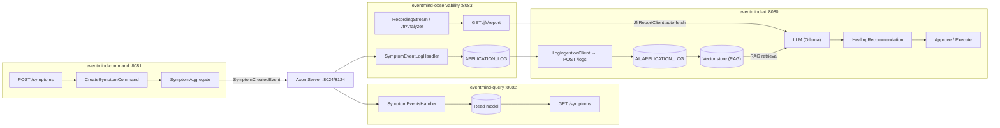
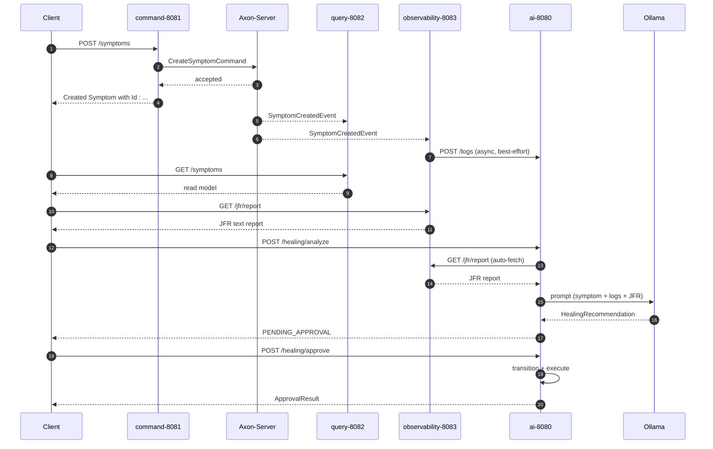

# EventMind

An event-driven, self-healing system for Java applications. EventMind captures application
symptoms through CQRS + Event Sourcing (Axon), observes runtime logs, and uses a RAG pipeline
(Spring AI) to generate and execute healing recommendations under human approval.

## Problem Statement

Production Java applications fail for reasons that are hard to pin down: an OOM, a GC
pressure spike, a cascading service timeout. The signals that could explain each failure are
scattered across symptoms, application logs, and JVM diagnostics, and the knowledge of how to
fix them usually lives only in someone's head. Diagnosing is slow, remediation is reactive and
manual, and every incident repeats the same tribal-knowledge lookup.

EventMind tackles that end to end:

- **Capture** symptoms as first-class, auditable facts (CQRS + Event Sourcing) instead of ad-hoc
  tickets.
- **Observe** the runtime: application logs and JVM/JFR diagnostics are recorded for every
  executed operation.
- **Contextualize** incidents with RAG, grounding the analysis in project documents and recent
  operational log entries.
- **Act** with guardrails: the LLM proposes a structured healing plan, but a human approves it
  before anything is executed.

## Architecture

### Component Flow



The pipeline is fully wired across modules:

- **REST → CQRS**: `POST /symptoms` dispatches a `CreateSymptomCommand` via Axon.
- **Events → Observability**: `SymptomCreatedEvent` is consumed by the observability
  module through the Axon event stream (`SymptomEventLogHandler`, tracking processor
  `observability`) and recorded into `APPLICATION_LOG`. Observability never reaches into
  the command module; it only reacts to published domain events.
- **Observability → AI (port ownership)**: the AI module never reads the observability
  database directly. It owns its own `AI_APPLICATION_LOG` store and ingests log entries
  through `POST /logs` (AI-side). The observability module is the producer: after
  recording an event it pushes the entry to `POST /logs` via `LogIngestionClient`
  (best-effort, asynchronous, failure-isolated), so each module stays isolated behind its
  own repository.
- **Logs → RAG**: log entries are fed into the vector store as knowledge documents.
- **RAG → LLM → Recommendation**: `POST /healing/analyze` retrieves relevant knowledge,
  builds a `DiagnosticContext` from recent application logs, and asks the LLM for a
  structured healing recommendation.
- **Recommendation execution**: recommendations require human approval and are executed
  through a pluggable `HealingExecutor`.


### End-to-End Sequence



## Design Decisions

### Why CQRS?

Symptoms are written once and read many times, from very different workloads. The write side
(`eventmind-command`) owns the invariants — idempotent create, origin validation, UUID
idempotency keys — and dispatches commands through Axon. The read side (`eventmind-query`)
keeps a denormalized, paginated read model and never has to worry about write contention.
CQRS lets each side scale, evolve, and fail independently, and it keeps the write model free of
read-optimization concerns.

### Why Event Sourcing?

Every symptom is an immutable fact, not a mutable row. Storing the event stream instead of (or
alongside) the current state gives EventMind a complete, replayable audit trail of everything
that happened, which matches the system's core promise: observable and explainable behavior.
Read models are derived projections that can be rebuilt or extended at any time, and duplicate
delivery (at-least-once semantics) is neutralized by aggregate idempotency rather than fragile
exactly-once tricks.

### Why RAG?

A bare LLM has no knowledge of this application's operating context — its services, its error
signatures, its runbook knowledge. RAG grounds every analysis in documents (`DocumentEntity`)
and recent application-log entries, so the recommendation is based on evidence the system can
trace back to a source instead of on the model's general guesses. Retrieval narrows the prompt
to the relevant context, which reduces hallucinations and keeps token costs bounded.

### Why JFR?

Java Flight Recorder is the lowest-overhead, always-on window into the JVM: GC, memory
pressure, and thread activity. EventMind records a custom `MethodExecutionEvent` (and
`CommandExecutionEvent`) via `AuditAspect` for every executed operation — class, method,
duration, status, and exception — producing a JVM-native trace alongside the application log.
That diagnostic signal (`jfrReport`) is passed straight into the LLM prompt during analysis, so
the AI reasons about the same heap/GC evidence an engineer would.

### Why Human Approval?

Autonomous healing is dangerous: the wrong remediation can drop data, restart a service in a
worse state, or amplify an incident. Recommendations therefore move through an explicit status
machine (`PENDING_APPROVAL → APPROVED/REJECTED → EXECUTED/FAILED`) and only execute after a
human approves. The decision is auditable, and optimistic locking (`@Version` + a guarded
`transitionStatus`) guarantees that two concurrent approvals cannot double-execute — the loser
gets an HTTP 409. Automation where it is safe, a human gate where it is not.

## Key Engineering Concepts

- **CQRS + Event Sourcing (Axon)**: commands write, domain events are immutable facts, and
  read models are derived projections. `eventmind-command` owns the invariants (idempotent
  create, origin validation), `eventmind-query` owns the paginated read model, and the event
  stream is a replayable audit trail.
- **Distributed event flow**: a `CreateSymptomCommand` produces a `SymptomCreatedEvent` that
  Axon Server fans out to the query read model and the observability log handler — one write,
  many projections.
- **Port ownership between modules**: observability owns `APPLICATION_LOG`; the AI module owns
  its own `AI_APPLICATION_LOG` and never reads another module's database. Observability pushes
  entries via `POST /logs` (`LogIngestionClient`, asynchronous, best-effort, failure-isolated).
- **Correlation ID threading**: a request-scoped `CorrelationId` flows through HTTP header →
  MDC → Axon command/event metadata → event handlers → the AI log store, so every log line
  (`[%X{correlationId:-}]`) and every persisted log entry ties back to the original request.
- **Live JFR diagnostics**: observability runs a JDK 21 `RecordingStream` (GC, CPU load,
  thrown exceptions, custom `MethodExecutionEvent`) and renders `GET /jfr/report`. The AI
  module auto-fetches that report per analysis (`JfrReportClient`) and injects it into the
  LLM prompt's `JVM/JFR ANALYSIS` section — the model reasons over the same heap/GC evidence
  an engineer would.
- **RAG with evidence**: the vector store is fed by project documents and recent AI application
  logs; retrieval narrows the LLM context to what is relevant, reducing hallucinations.
- **LLM with guardrails**: the LLM returns a structured `HealingRecommendation` that moves
  through an explicit status machine (`PENDING_APPROVAL → APPROVED/REJECTED → EXECUTED/FAILED`)
  and only executes after a human approves. Optimistic locking (`@Version` + guarded
  `transitionStatus`) makes concurrent approvals fail with HTTP 409.
- **Failure isolation**: every pipeline input degrades independently — LLM down → default
  recommendation (confidence 0); vector store down → empty knowledge context; observability
  down → analysis without the JFR report.
- **Idempotency**: symptom creation accepts a client-supplied UUID idempotency key; origin is
  encoded as a numeric bitmask (`["A","B"]` → `3`) and re-encoded to symbolic names on read.

## Modules

| Module                | Port | Description                                                                 |
|-----------------------|------|-----------------------------------------------------------------------------|
| `eventmind-command`   | 8081 | Axon aggregate, command handling, symptom/healing REST entry points          |
| `eventmind-query`     | 8082 | Query side: reads symptoms from the event store via `QueryGateway`           |
| `eventmind-observability` | 8083 | Application log persistence (`APPLICATION_LOG`), JFR auditing, `AuditAspect` |
| `eventmind-ai`        | 8080 | RAG ingestion/retrieval, LLM analysis, recommendation store, approval flow   |
| `eventmind-shared`    |  -   | Shared DTOs, exceptions, validation and the `@AuditLog` annotation           |

## Technologies

| Layer          | Technology                                                                                  |
|----------------|---------------------------------------------------------------------------------------------|
| Language       | Java 21 (records, pattern matching, JDK 21 `RecordingStream` for live JFR)                   |
| Framework      | Spring Boot 3.5.4, Spring Web, Spring Data JPA                                              |
| Messaging / DDD| Axon Framework 4.11 (command/event/query gateways, aggregates, event sourcing), Axon Server 2024.2.2 |
| AI             | Spring AI 1.0.0 (`spring-ai-starter-model-ollama`, `spring-ai-starter-vector-store-pgvector`)|
| LLM            | Ollama (`llama3.1`, default base-url `http://localhost:11434`)                              |
| Data           | JPA / Hibernate; H2 (command/query/observability); Postgres + pgvector (AI); Flyway migrations |
| Validation     | Jackson + JSON-Schema validation (`JsonSchemaValidator`, RFC 7807 `ProblemDetail` errors)   |
| Observability  | Java Flight Recorder (GC, CPU load, exceptions, custom `MethodExecutionEvent`), `@AuditLog` AOP aspect, correlation IDs in MDC |
| Build          | Maven multi-module reactor, Maven Wrapper, `maven-dependency-plugin:analyze` hygiene gate    |

## Prerequisites

- JDK 21
- Docker (for Axon Server)
- Ollama with a model configured (default `llama3.1`) — the LLM call degrades gracefully
  to a default recommendation when unavailable
- Postgres (default `localhost:5432/eventmind`)
- A `.env` file at the repository root holding the local connection secrets (git-ignored).
  Required variables:

  ```properties
  DB_URL=jdbc:postgresql://localhost:5432/eventmind
  DB_USERNAME=
  DB_PASSWORD=
  COMMAND_DB_PASSWORD=
  QUERY_DB_PASSWORD=
  OBSERVABILITY_DB_PASSWORD=
  ```

  Each module loads it automatically via
  `spring.config.import=optional:file:../.env[.properties]`, so the file must be
  resolvable as `../.env` relative to the module directory (the default working
  directory for both `spring-boot:run` and IDE run configurations).

## Getting Started

1. Create the `.env` file at the repository root (see [Prerequisites](#prerequisites)) with
   the local database passwords. It is git-ignored, so it is never committed.

2. Start Axon Server:

   ```bash
   docker compose up -d
   ```

   Axon Server UI: `http://localhost:8024` (gRPC on `8124`).

3. Build and run tests (offline, using the local `.m2` cache):

   ```powershell
   $env:JAVA_HOME="D:\JDK\jdk21"
   .\mvnw.cmd -o clean test
   ```

4. Run each module (either from the IDE or via `.\mvnw.cmd -o spring-boot:run -pl <module>`):
   `eventmind-command`, `eventmind-query`, `eventmind-ai`, and optionally
   `eventmind-observability`.

## Running the Demo

A minimal end-to-end run needs Axon Server (the shared event bus) plus the four modules.
Docker provides Axon Server; Postgres and Ollama are required only for the AI analysis steps.
Make sure the root `.env` file exists first (see [Prerequisites](#prerequisites)); without it
the modules will not start.

1. **Start Axon Server** (Docker):

   ```bash
   docker compose up -d
   ```

   Axon Server UI: `http://localhost:8024` (gRPC on `8124`).

2. **Build and test** (offline, using the local `.m2` cache):

   ```powershell
   $env:JAVA_HOME="D:\JDK\jdk21"
   .\mvnw.cmd -o clean test
   ```

3. **Start the modules** — one terminal each (or via the IDE):

   ```powershell
   .\mvnw.cmd -o spring-boot:run -pl eventmind-command        # 8081
   .\mvnw.cmd -o spring-boot:run -pl eventmind-query          # 8082
   .\mvnw.cmd -o spring-boot:run -pl eventmind-observability  # 8083
   .\mvnw.cmd -o spring-boot:run -pl eventmind-ai             # 8080
   ```

4. **Create a symptom** (command side, port 8081) — the event is published through Axon Server
   to the query and observability event handlers:

   ```powershell
   Invoke-RestMethod -Uri "http://localhost:8081/symptoms" -Method Post -ContentType "application/json" `
     -Body '{"id":"77a1b2c3-4d5e-4f6a-8b7c-9d0e1f2a3b4c","name":"Database timeout","origin":["A","B"],"numberOfOccurance":3}'
   ```

   Expect `Created Symptom with Id : 77a1b2c3-...`.

5. **Read the read model** (query side, port 8082):

   ```powershell
   Invoke-RestMethod -Uri "http://localhost:8082/symptoms?name=&page=0&size=20"
   ```

6. **Inspect live JVM diagnostics** (observability, port 8083) — a text report of GC, CPU load
   and thrown exceptions captured by the observability JVM's `RecordingStream`:

   ```powershell
   Invoke-RestMethod -Uri "http://localhost:8083/jfr/report"
   ```

7. **Analyze with the LLM** (AI, port 8080) — when `jfrReport` is not supplied in the request,
   the AI module auto-fetches it from observability and injects it into the prompt:

   ```powershell
   Invoke-RestMethod -Uri "http://localhost:8080/healing/analyze" -Method Post -ContentType "application/json" `
     -Body '{"symptom":"Database timeout"}'
   ```

   Expect a `HealingRecommendation` with `status: PENDING_APPROVAL`.

8. **Approve (and execute) the recommendation**:

   ```powershell
   Invoke-RestMethod -Uri "http://localhost:8080/healing/approve" -Method Post -ContentType "application/json" `
     -Body '{"recommendationId":"<id>","decision":"APPROVED","approvedBy":"ravi","comment":"go ahead"}'
   ```

9. **(Optional) Rebuild the RAG knowledge base** before step 7, to ground analysis in your
   documents and ingested logs:

   ```powershell
   Invoke-RestMethod -Uri "http://localhost:8080/healing/knowledge/ingest" -Method Post
   ```

> **Notes**: `eventmind-ai` requires Postgres (pgvector). Real LLM output requires Ollama with
> `llama3.1` running at `http://localhost:11434`. The pipeline degrades gracefully when either is
> unavailable — the LLM call falls back to a default recommendation (confidence 0), and a
> missing observability module means analysis runs without the JFR report.

## REST API

### Symptom (CQRS)

`POST http://localhost:8081/symptoms` — create a symptom

```json
{
  "id": "77a1b2c3-4d5e-4f6a-8b7c-9d0e1f2a3b4c",
  "name": "Database timeout",
  "origin": ["A", "B"],
  "numberOfOccurance": 3
}
```

`origin` is a non-empty JSON array of `OriginType` symbolic names — `A`, `B`, `C`, `D`,
`E`. The server cumulates the values into a numeric bitmask stored with the symptom
(`["A","B"]` → `3`, the OR of the per-type flags `1,2,4,8,16`). The optional `id` is the
client-supplied idempotency key; if omitted the server generates a UUID.

`GET http://localhost:8082/symptoms?name=&page=0&size=20` — list symptoms

The response re-encodes the stored bitmask back to the symbolic `origin` names, so the
wire contract is symmetric: requests and responses both carry `origin` as an array of
`OriginType` names.

### Healing (AI)

`POST http://localhost:8080/healing/analyze` — analyze a symptom and produce a recommendation

```json
{
  "symptomId": "s1",
  "symptom": "OOM",
  "logs": "ERROR heap exhausted",
  "jfrReport": "GC paused",
  "topK": 3
}
```

`GET http://localhost:8080/healing/recommendations/{id}` — fetch a recommendation

`POST http://localhost:8080/healing/approve` — approve or reject a recommendation

```json
{
  "recommendationId": "r1",
  "decision": "APPROVED",
  "approvedBy": "ravi",
  "comment": "go ahead"
}
```

`POST http://localhost:8080/healing/knowledge/ingest` — (re)build the RAG knowledge base
from `documents` and recent AI log entries

`POST http://localhost:8080/logs` — ingest an application log entry into the AI-owned
`AI_APPLICATION_LOG` store (RAG knowledge source)

```json
{
  "level": "ERROR",
  "message": "Database timeout",
  "exception": "connect timed out"
}
```

`POST http://localhost:8081/healing/approve` — command-side healing plan approval

## RAG Knowledge Sources

The vector store is fed by `DocumentLoader`, which combines:

- `DocumentEntity` rows (`documents` table, type/source/domain tagged)
- Recent `ApplicationLogEntity` rows from the AI-owned `AI_APPLICATION_LOG` table
  (ingested via `POST /logs`, read through the `LogProvider` port)

## Failure Isolation

Each AI pipeline step degrades independently:

- LLM unavailable → default recommendation with confidence 0
- Vector store unavailable → empty knowledge context (RAG skipped)
- Log load failure → empty log context

## Concurrency & State Integrity

- `HealingRecommendationEntity` carries a JPA `@Version` for optimistic locking.
- Status changes go through an atomic guarded update
  (`transitionStatus(id, from, to)`), so two concurrent approvals cannot double-execute:
  the loser gets HTTP 409. Missing recommendations return HTTP 404.
- The status machine is enforced in `HealingRecommendationService`:
  `PENDING_APPROVAL → APPROVED/REJECTED → EXECUTED/FAILED`.

## Known Notes

- `eventmind-ai` requires Postgres; command/query/observability use H2 file DBs.
- `docker-compose.yml` runs Axon Server only. The old single-module `dockerfile`
  was removed: it referenced a non-existent `eventmind-application` module and
  cannot represent this multi-app system (command/query/ai/observability each run
  as their own process on their own port). Run each module with
  `.\mvnw.cmd -o spring-boot:run -pl <module>` instead.
- Dependency hygiene is enforced centrally: Axon/Guava versions live in the parent
  BOM only, and `maven-dependency-plugin:analyze` fails the build on unused or
  undeclared dependencies (`clean test`).